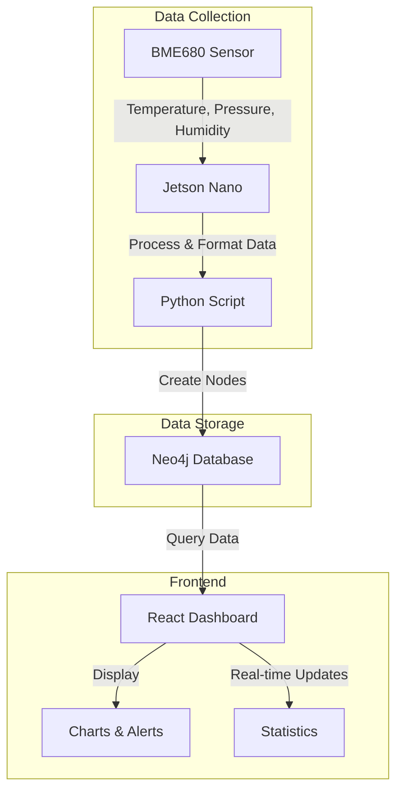
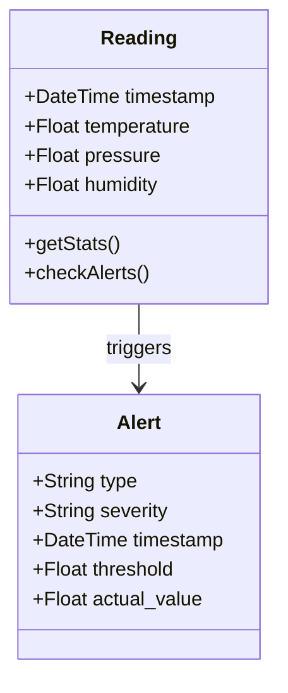
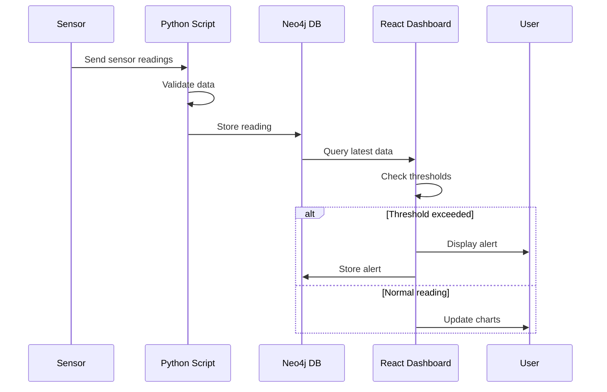

# System Architecture

This document describes the architecture of the BME680 sensor monitoring system.

## System Overview

## Data Model

## Alert System Flow

## Component Details

### Data Collection
- BME680 sensor provides temperature, pressure, and humidity readings
- Jetson Nano reads sensor data via I2C interface
- Python script processes and validates the data

### Data Storage
- Neo4j graph database stores all sensor readings
- Each reading is stored as a node with timestamp and measurements
- Alerts are stored as related nodes when thresholds are exceeded

### Frontend
- React dashboard provides real-time visualization
- Charts show historical trends
- Alert system monitors for anomalies
- Statistical analysis provides insights

## Alert Thresholds

- Temperature:
  - Low: < 22°C
  - High: > 28°C
- Pressure:
  - Low: < 985 hPa
  - High: > 1015 hPa
- Humidity:
  - Low: < 35%
  - High: > 60%